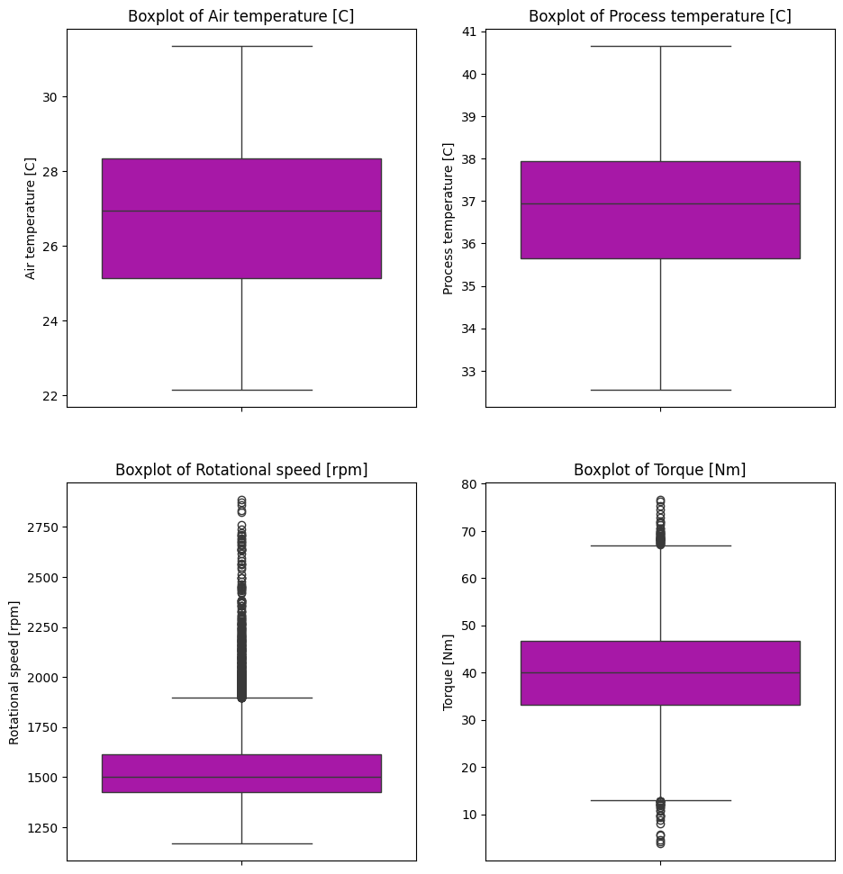
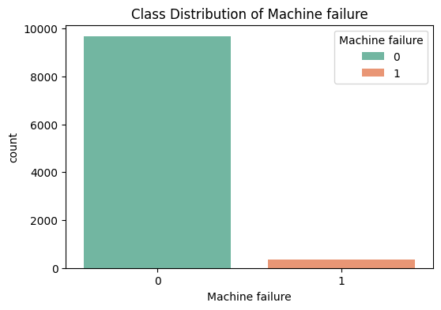
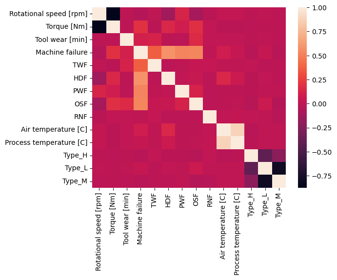

# ABOUT THE DATASET

The dataset has 10 000 data points stored as rows with 14 features in column.

UID is an unique identifier (this is the index of the data frame)
Product ID contains data like L, M and H. It refers to the quality variants of the machine and serial number.
There is also other column which has only quality level without serial number and its called Type. 
Air temperature [K] is an ambient temperature around the machine.
Process temperature [K] is a temperature of the specific manufacturing process.
Rotational speed [rpm] The speed at which the machine operates.
Torque [Nm] The rotational force applied by the machine.

Tool wear [min] The amount of time the tool has been in use. (this is what we want to predict in our project)

Machine Failure (bool):
TWF Tool Wear Failure
HDF Heat Dissipation Failure
PWF Power Failure
OSF Overstrain Failure
RNF Random Failures 

# MACHINES PROJECT

The project focuses on the prediction on Tool wear (min). The goal is to estimate the amount of time the machine would work before failure based on operational parameters like temperature, torque, and rotational speed.

Language: Python
Libraries:
Seaborn and Matplotlib (Vizualization)
Sklearn ( One Hot Encoding )
....

## Key Points:
Outliers in Torque and Rotational Speed were retained after analysis, as they represent critical operational extremes rather than data errors.

All failure-related columns were dropped from the feature set (X).

Used One-Hot Encoding for machine types, dropping the Type_L column to avoid the Dummy Variable Trap.

## EDA 

Thermal distributions (both ambient air and process temperatures) demonstrate high stability, with medians of 26.5°C and 37°C. The absence of outliers in these features suggests that the thermal environment remained well-controlled and predictable during the observed cycles.
While the rotational speed maintains a median of 1500 RPM, the distribution shows a significant number of outliers at the higher end of the spectrum. Similarly, the torque analysis reveals anomalies at both the lower and upper extremes. Although these data points are statistically classified as outliers, I have determined them to be physically realistic.

The visualization reveals a significant class imbalance within the dataset

The correlation heatmap provides a comprehensive overview of the linear relationships between parameters. A dominant feature is the negative correlation between Rotational Speed and Torque, which is consistent with the physical laws. Regarding the categorical features (Type_H, Type_L, Type_M), the strong negative correlations observed between them are a direct mathematical consequence of the One-Hot Encoding process. 
While Machine failure and specific failure modes (for instance TWF, HDF) show visible correlations with tool wear, they will be excluded from the feature set to prevent data leakage, ensuring the model remains predictive rather than reactive.