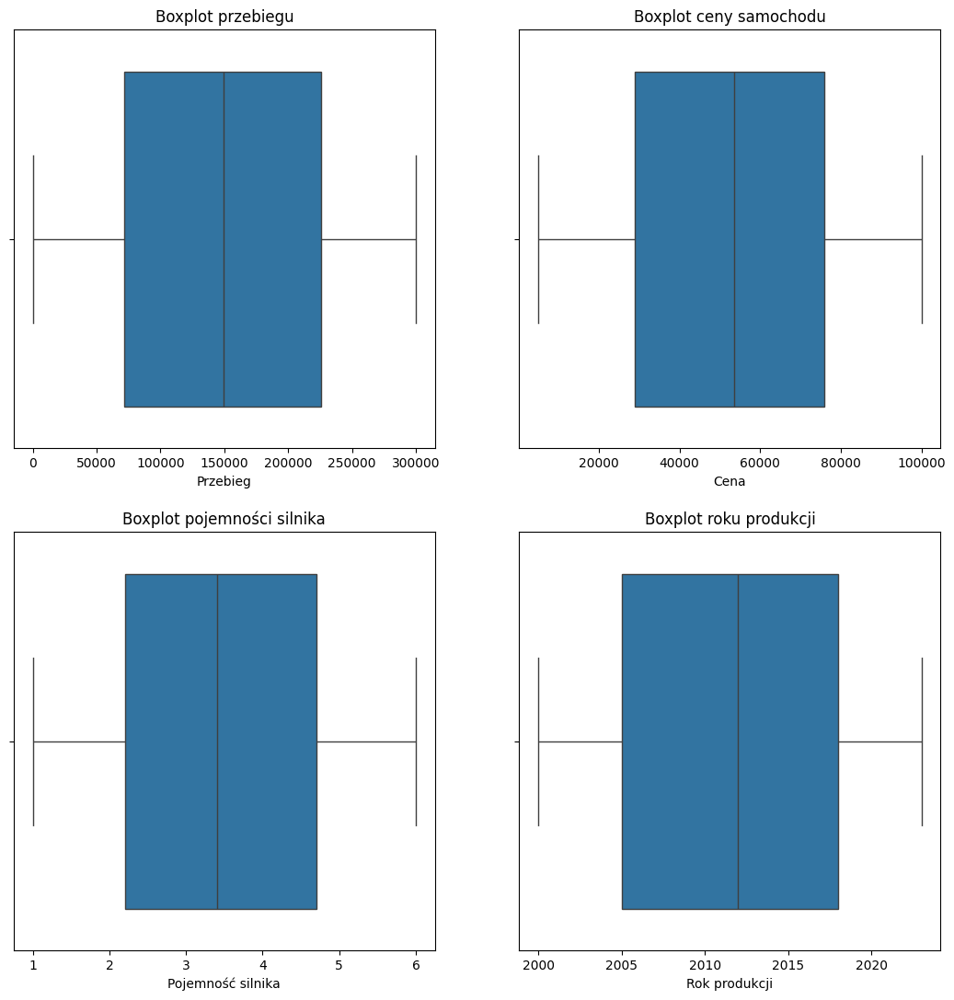
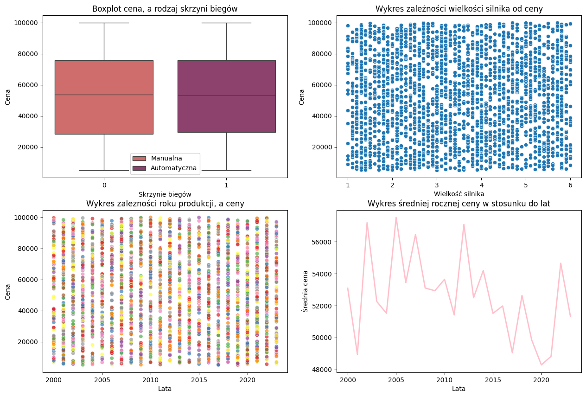
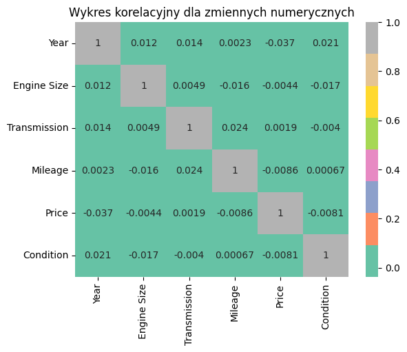

O PROJEKCIE

Celem projektu była kompleksowa analiza zbioru danych dotyczącego cen samochodów oraz przygotowanie danych pod przyszłe modele uczenia maszynowego. Skupiłam się na identyfikacji kluczowych czynników wpływających na wartość pojazdu oraz na transformacji danych kategorycznych na format numeryczny.

Język: Python
Biblioteki: Pandas,NumPy, Seaborn, Matplotlib

Kluczowe Etapy

Preprocessing:
Sprawdzenie braków (NA), duplikatów oraz analiza statystyczna zmiennych. Zdecydowano, aby usunąć kolumnę Car ID, ze względu na to, że zawierała tylko wartości ponumerowane, uniklane, więc była nieistotna statystycznie.
Analiza wartości odstających. Potwierdzenie spójności danych w obszarach przebiegu, ceny i rocznika.

Feature Engineering
Przekształcenie zmiennej Transmission na format 0/1 (Manual/Automatic).
Mapowanie stanu pojazdu (Condition) na skale 0-2 (Used, Like New, New).
Transformacja zmiennej Fuel Type na osobne kolumny binarne, aby uniknąć błędnej interpretacji hierarchii przez algorytmy.

Analiza Wizualna
Stworzenie Heatmapu dla zmiennych numerycznych w celu wykrycia zależności.
Analiza scatterplotów dla zależności ceny od roku produkcji oraz wielkości silnika.
Wyznaczenie średnich cen dla marek oraz mediany ceny w zależności od stanu technicznego pojazdu.

