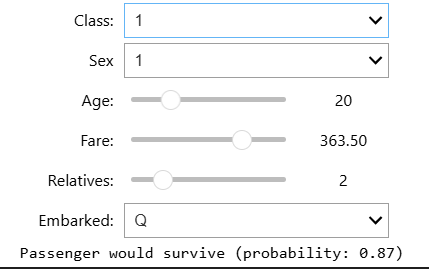
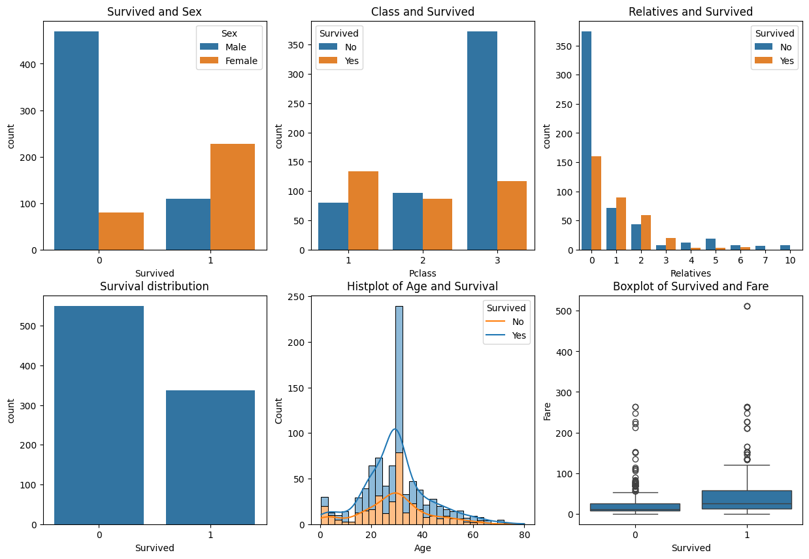

# Titanic Survival Prediction End-to-End ML

## ABOUT THE PROJECT

This project goes beyond simple classification by implementing a rigorous data cleaning and preprocessing pipeline for the famous Titanic dataset. The goal is to predict passenger survival while ensuring high data quality through statistical analysis and interactive simulation.

Language: Python
Data Processing: Pandas, NumPy
Scikit-learn: RandomForestClassifier, SimpleImputer, RandomOverSampler
Visualization: Seaborn, Matplotlib
UX: ipywidgets

## Data Debugging:

Outlier Detection: Identified and removed incorrect entries in the Survived label using boxplot analysis (values other than 0 or 1).
Imputation: Handled missing values in Age (mean strategy) and Embarked (most frequent strategy).
Data Transformation: Cleaned the Fare column by removing special characters and converting it to float for numerical analysis.
Class Imbalance Detection: Implemented RandomOverSampler to ensure the model trained equally on both survivors and non-survivors.

## Feature Engineering
Dimension Reduction: Combined SibSp and Parch into a single Relatives feature, simplifying the model while retaining family-related survival context.
Categorical Encoding: Implemented manual binary encoding for Sex and One-Hot Encoding for the Embarked port.

Developed a simulator where users can input passenger details to see the survival probability generated by the Random Forest model.

## EDA analysis

Gender Impact: A significant survival bias towards female passengers, indicating that gender was a primary predictor in the model.
Socio-economic Status: A strong positive correlation exists between ticket class (1st and 2nd) and survival rates.
Family Impact: Solo travelers exhibited a higher survival frequency than those traveling in family groups.
Demographics: The age distribution reveals that the majority of survivors were concentrated in the young adult demographic.
