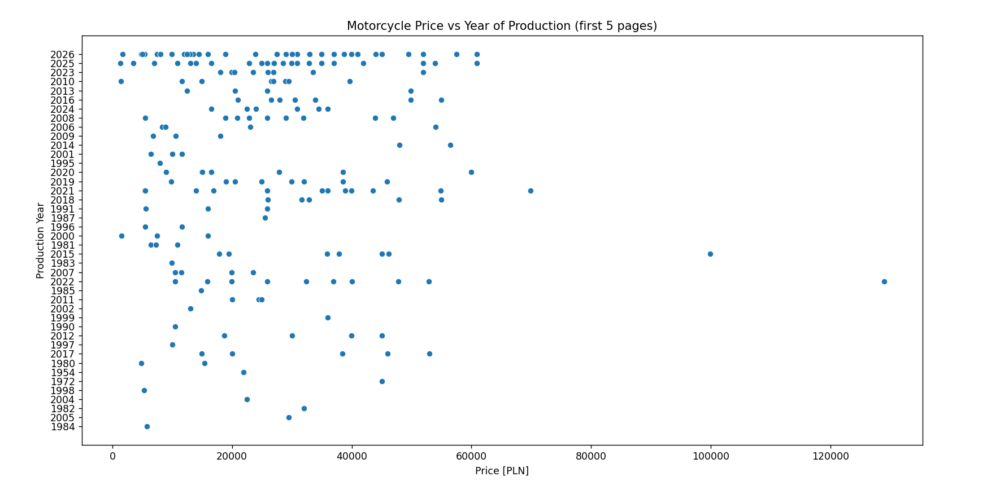

# OLX Motorcycle Market Scraper

Automated tool for monitoring motorcycle market trends on OLX.pl. The project automates the data acquisition process for the first 5 pages of search results and visualizes the correlation between manufacturing year and price.

Language:
Python

## Libraries:
BeautifulSoup4 (Web scraping)
Pandas (Data cleaning and transformation) 
Seaborn and Matplotlib (Visualization)

## Key Features
Bypassing Mechanisms: Implemented custom User-Agent headers to avoid basic anti-scraping blocks.
Automated Data Cleaning: Regex-based price extraction
Dynamic data type conversion for numerical analysis.
Dynamic Reporting: Generates timestamped CSV reports for historical price tracking.

### Example of usage(20.03.2026):

